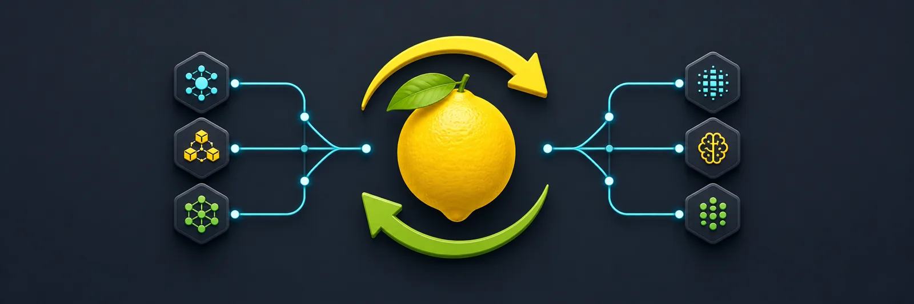

# llemon-swap

llemon-swap is a Lemonade-aware model lifecycle proxy and scheduler. It presents one OpenAI- and Anthropic-compatible endpoint, keeps preferred models resident, temporarily makes room for on-demand models, and restores displaced defaults after their work finishes.

This project is a fork of [mostlygeek/llama-swap](https://github.com/mostlygeek/llama-swap). It retains llama-swap's process-managed models, routing, queueing, UI, metrics, configuration compatibility, license, and project history while adding lifecycle-managed providers. Existing llama-swap configurations remain valid.

## Motivation

llemon-swap started from a practical goal: switch seamlessly between models managed by Lemonade Server and [DwarfStar 4 (`ds4`)](https://github.com/antirez/ds4) through one client endpoint. Lemonade stays online and manages its resident model pool, while llemon-swap can start and stop `ds4-server` as a process-managed backend using llama-swap's existing lifecycle support.

## What llemon-swap adds

- Lemonade Server discovery, health, load, unload, and public pin/unpin integration
- `hard-pinned`, `preferred`, `transient`, and `external` residency policies
- Per-provider lifecycle pools without changing llama-swap's existing matrix semantics
- Resident-first scheduling with deterministic FIFO ordering and bounded fairness
- Coalesced cold loads, active-stream eviction protection, displaced-default restoration, and drift reconciliation
- Provider state in the Web UI, `GET /api/providers`, `GET /ready`, structured logs, and Prometheus metrics

## Lemonade + DwarfStar 4 quick start

Start Lemonade Server separately and install DwarfStar 4 under `/opt/ds4`, then use a lifecycle pool. In this example, `main-chat` and `fast-chat` fill both Lemonade slots. Work for `occasional-coder` temporarily displaces the lower-priority default; the default is restored and repinned after 30 seconds without transient work. Selecting `deepseek-v4-flash` starts `ds4-server` on demand and selecting a Lemonade alias routes back to the persistent Lemonade provider.

```yaml
providers:
  lemonade-local:
    type: lemonade
    baseURL: http://127.0.0.1:13305
    # apiKeyEnv: LEMONADE_API_KEY
    # adminApiKeyEnv: LEMONADE_ADMIN_API_KEY

lifecyclePools:
  primary:
    provider: lemonade-local
    capacity: 2
    restorePreferred: true
    transientIdleTTL: 30s
    residentFirst: true
    maxResidentBurst: 8
    maxResidentWait: 10s

models:
  main-chat:
    provider: lemonade-local
    providerModel: Qwen3.5-35B-GGUF
    lifecyclePool: primary
    residency: preferred
    residencyPriority: 0
  fast-chat:
    provider: lemonade-local
    providerModel: Qwen3-4B-GGUF
    lifecyclePool: primary
    residency: preferred
    residencyPriority: 1
  occasional-coder:
    provider: lemonade-local
    providerModel: Qwen3-Coder-GGUF
    lifecyclePool: primary
    residency: transient

  deepseek-v4-flash:
    cmd: /opt/ds4/ds4-server --chdir /opt/ds4 --ctx 100000 --kv-disk-dir /tmp/ds4-kv --kv-disk-space-mb 8192
    proxy: http://127.0.0.1:8000
    checkEndpoint: /v1/models
    useModelName: deepseek-v4-flash
    ttl: 300
```

The Lemonade capacity and restoration policy apply only to Lemonade-backed models. DwarfStar 4 remains process-managed: llemon-swap starts it when requested and stops it after the configured `ttl`.

See the [Lemonade lifecycle guide](docs/lemonade.md), [configuration reference](docs/configuration.md), and [complete example](docs/examples/lemonade/config.yaml).

## Inherited llama-swap features

- ✅ Easy to deploy and configure: one binary, one configuration file. no external dependencies
- ✅ On-demand model switching
- ✅ Use any local OpenAI compatible server (llama.cpp, vllm, tabbyAPI, stable-diffusion.cpp, etc.)
  - future proof, upgrade your inference servers at any time.
- ✅ OpenAI API supported endpoints:
  - `v1/completions`
  - `v1/chat/completions`
  - `v1/responses`
  - `v1/embeddings`
  - `v1/models` - list available models
  - `v1/audio/speech` ([#36](https://github.com/mostlygeek/llama-swap/issues/36))
  - `v1/audio/transcriptions` ([docs](https://github.com/mostlygeek/llama-swap/issues/41#issuecomment-2722637867))
  - `v1/audio/voices`
  - `v1/images/generations`
  - `v1/images/edits`
- ✅ Anthropic API supported endpoints:
  - `v1/messages`
  - `v1/messages/count_tokens`
- ✅ llama-server (llama.cpp) supported endpoints
  - `v1/rerank`, `v1/reranking`, `/rerank`
  - `/infill` - for code infilling
  - `/completion` - for completion endpoint
  - `/props` - requires `?model={model_id}` query parameter to be provided. The autoload parameter is not supported and will be ignored.
- ✅ SDAPI via [stable-diffusion.cpp's server](https://github.com/leejet/stable-diffusion.cpp/tree/master/examples/server)
  - `/sdapi/v1/txt2img`
  - `/sdapi/v1/img2img`
  - `/sdapi/v1/loras` - requires `model` in request body to fetch the correct loras
- ✅ llemon-swap API
  - `/ui` - web UI
  - `/upstream/:model_id` - direct access to upstream server ([demo](https://github.com/mostlygeek/llama-swap/pull/31))
  - `/running` - list currently running models ([#61](https://github.com/mostlygeek/llama-swap/issues/61))
  - `POST /api/models/unload` - manually unload all running models ([#58](https://github.com/mostlygeek/llama-swap/issues/58))
  - `POST /api/models/unload/:model_id` - unload a specific model
  - `GET /api/profiles` - list configured profiles and the active selection
  - `PUT /api/profiles/active` - activate a profile or select none
  - `/logs` - remote log monitoring
    - `GET /logs` returns buffered plain text logs.
      - If `Accept: text/html` is sent, `/logs` redirects to `/ui/`.
    - `GET /logs/stream` keeps the connection open for live log streaming.
      - Stream endpoints send buffered history first by default; add `?no-history` to stream only new lines.
    - `GET /logs/stream/proxy` streams proxy logs only.
    - `GET /logs/stream/upstream` streams upstream process logs only.
    - `GET /logs/stream/{model_id}` streams logs for one model (including IDs with slashes, like `author/model`).
  - `/health` - just returns "OK"
  - `/ready` - required-provider and preferred-model readiness
  - `/api/providers` - provider health, residency, transitions, active work, and restoration state
  - `/metrics` - system and GPU metrics for prometheus
- ✅ API Key support - define keys to restrict access to API endpoints
- ✅ Customizable
  - Switch model ID routing at runtime with profiles
  - Run concurrent models with a custom DSL swap matrix ([#643](https://github.com/mostlygeek/llama-swap/issues/643))
  - Automatic unloading of models after timeout by setting a `ttl`
  - Docker and Podman support using `cmd` and `cmdStop` together
  - Preload models on startup with `hooks` ([#235](https://github.com/mostlygeek/llama-swap/pull/235))
  - Apply filters to requests to control inference with `stripParams`, `setParams` and `setParamsByID`

### Web UI

llemon-swap includes the upstream real-time web interface and adds provider and residency state to the model dashboard:


View detailed token metrics:


Inspect request and responses:


Manually load and unload models:


Real time log streaming:


## Installation

Download a pre-built archive from the [llemon-swap releases](https://github.com/cloetzi/llemon-swap/releases), or build this fork from source:

```shell
git clone https://github.com/cloetzi/llemon-swap.git
cd llemon-swap
make clean all
# binaries are written to build/llemon-swap-*
```

The package-manager and container instructions below describe inherited upstream llama-swap distributions. Those artifacts do not include llemon-swap provider lifecycle support.

llama-swap can be installed in multiple ways:

1. Docker
2. Homebrew (macOS and Linux)
3. MacPorts (macOS)
4. WinGet
5. From release binaries
6. From source

### Docker Install ([download images](https://github.com/mostlygeek/llama-swap/pkgs/container/llama-swap))

Two types of container images are built nightly for llama-swap:

1. A unified container with llama-server, ik-llama-server, stable-diffusion.cpp, whisper.cpp and llama-swap built from source. This is only available for cuda and vulkan but has more capabilities. This one is recommended for use.
2. A legacy image that is based on llama.cpp's images and llama-swap copied into the container. Use this one if you prefer to stay close to llama.cpp's container images.

#### Unified container (Recommended)

```shell
$ docker pull ghcr.io/mostlygeek/llama-swap:unified-cuda

# run with a custom configuration and models directory
$ docker run -it --rm --runtime nvidia -p 9292:8080 \
 -v /path/to/models:/models \
 -v /path/to/custom/config.yaml:/etc/llama-swap/config/config.yaml \
 ghcr.io/mostlygeek/llama-swap:unified-cuda
```

#### Legacy container

```shell
$ docker pull ghcr.io/mostlygeek/llama-swap:cuda

# run with a custom configuration and models directory
$ docker run -it --rm --runtime nvidia -p 9292:8080 \
 -v /path/to/models:/models \
 -v /path/to/custom/config.yaml:/app/config.yaml \
 ghcr.io/mostlygeek/llama-swap:cuda
```

<details>
<summary>
more examples
</summary>

```shell
# pull latest images per platform
docker pull ghcr.io/mostlygeek/llama-swap:cpu
docker pull ghcr.io/mostlygeek/llama-swap:cuda
docker pull ghcr.io/mostlygeek/llama-swap:vulkan
docker pull ghcr.io/mostlygeek/llama-swap:intel
docker pull ghcr.io/mostlygeek/llama-swap:musa

# tagged llama-swap, platform and llama-server version images
docker pull ghcr.io/mostlygeek/llama-swap:v166-cuda-b6795

# non-root cuda
docker pull ghcr.io/mostlygeek/llama-swap:cuda-non-root

```

</details>

### Homebrew Install (macOS/Linux)

```shell
brew tap mostlygeek/llama-swap
brew install llama-swap
llama-swap --config path/to/config.yaml --listen localhost:8080
```

### MacPorts (macOS)

> [!NOTE]
> Maintained by MacPorts community - [llama-swap port](https://ports.macports.org/port/llama-swap). It is not an official part of llama-swap.

```shell
sudo port install llama-swap
llama-swap --config path/to/config.yaml --listen localhost:8080
```

### WinGet Install (Windows)

> [!NOTE]
> WinGet is maintained by community contributor [Dvd-Znf](https://github.com/Dvd-Znf) ([#327](https://github.com/mostlygeek/llama-swap/issues/327)). It is not an official part of llama-swap.

```shell
# install
C:\> winget install llama-swap

# upgrade
C:\> winget upgrade llama-swap
```

### Pre-built Binaries

llemon-swap binaries are published to this repository's [release page](https://github.com/cloetzi/llemon-swap/releases) for Linux, macOS, Windows, and FreeBSD.

### Building from source

1. Building requires Go and Node.js (for UI).
1. `git clone https://github.com/cloetzi/llemon-swap.git`
1. `make clean all`
1. look in the `build/` subdirectory for the llama-swap binary

## Configuration

```yaml
# minimum viable config.yaml

models:
  model1:
    cmd: llama-server --port ${PORT} --model /path/to/model.gguf
```

That's all you need to get started:

1. `models` - holds all model configurations
2. `model1` - the ID used in API calls
3. `cmd` - the command to run to start the server.
4. `${PORT}` - an automatically assigned port number

Almost all configuration settings are optional and can be added one step at a time:

- Advanced features
  - `matrix` to run concurrent models with a custom swap logic DSL
  - `hooks` to run things on startup
  - `macros` reusable snippets
- Model customization
  - `ttl` to automatically unload models
  - `unloadTimeout` to tune graceful unloads (manual, API and `ttl` expiry)
  - `aliases` to use familiar model names (e.g., "gpt-4o-mini")
  - `env` to pass custom environment variables to inference servers
  - `cmdStop` gracefully stop Docker/Podman containers
  - `useModelName` to override model names sent to upstream servers
  - `${PORT}` automatic port variables for dynamic port assignment
  - `filters` rewrite parts of requests before sending to the upstream server

See the [configuration documentation](docs/configuration.md) for all options.

## How does llemon-swap work?

For process-managed models, llemon-swap preserves llama-swap behavior: it extracts `model`, starts the configured server if needed, and swaps incompatible processes.

For Lemonade-backed models, the Lemonade process remains running. llemon-swap reconciles observed residency, drains an evictable model, calls Lemonade's public lifecycle API, proxies inference without buffering, and accounts for the request until the response or stream really ends. A separate `lifecyclePool` expresses provider capacity; the existing `matrix` continues to express valid process concurrency combinations.

## Reverse Proxy Configuration (nginx)

If you deploy llama-swap behind nginx, disable response buffering for streaming endpoints. By default, nginx buffers responses which breaks Server‑Sent Events (SSE) and streaming chat completion. ([#236](https://github.com/mostlygeek/llama-swap/issues/236))

Recommended nginx configuration snippets:

```nginx
# SSE for UI events/logs
location /api/events {
    proxy_pass http://your-llama-swap-backend;
    proxy_buffering off;
    proxy_cache off;
}

# Streaming chat completions (stream=true)
location /v1/chat/completions {
    proxy_pass http://your-llama-swap-backend;
    proxy_buffering off;
    proxy_cache off;
}
```

As a safeguard, llama-swap also sets `X-Accel-Buffering: no` on SSE responses. However, explicitly disabling `proxy_buffering` at your reverse proxy is still recommended for reliable streaming behavior.

## Monitoring Logs on the CLI

```sh
# sends up to the last 10KB of logs
$ curl http://host/logs

# streams combined logs
curl -Ns http://host/logs/stream

# stream llama-swap's proxy status logs
curl -Ns http://host/logs/stream/proxy

# stream logs from upstream processes that llama-swap loads
curl -Ns http://host/logs/stream/upstream

# stream logs only from a specific model
curl -Ns http://host/logs/stream/{model_id}

# stream and filter logs with linux pipes
curl -Ns http://host/logs/stream | grep 'eval time'

# appending ?no-history will disable sending buffered history first
curl -Ns 'http://host/logs/stream?no-history'
```

## Do I need to use llama.cpp's server (llama-server)?

Any OpenAI compatible server would work. llama-swap was originally designed for llama-server and it is the best supported.

For Python based inference servers like vllm or tabbyAPI it is recommended to run them via podman or docker. This provides clean environment isolation as well as responding correctly to `SIGTERM` signals for proper shutdown.
